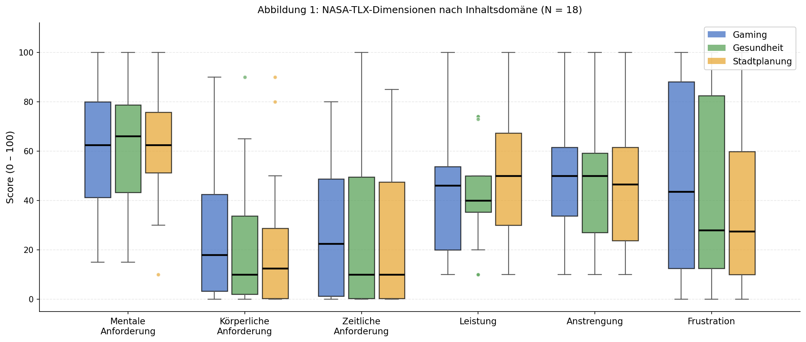
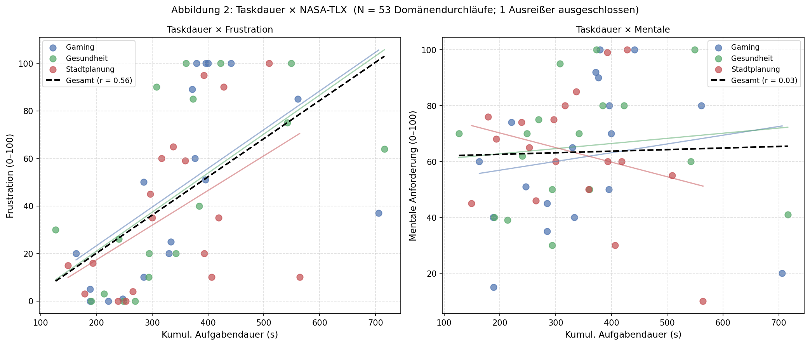

# Kognitive Beanspruchung bei der Exploration interaktiver Datenvisualisierungen: Domäneneffekte und Belastungsindikatoren

**Jonas Kimmer**  
Hochschule / Universität · Masterstudiengang · 2025

---

## Zusammenfassung

Bearbeitungszeit gilt in Usability-Studien häufig als Proxy für kognitive Beanspruchung, obwohl unklar ist, ob sie tatsächlich mentale Last oder andere Faktoren wie Frustration und Domänenvertrautheit abbildet. Diese Studie untersucht, ob sich die kognitive Beanspruchung bei der Exploration interaktiver Datenvisualisierungen je nach Inhaltsdomäne unterscheidet, und ob Bearbeitungszeit ein verlässlicher Indikator für kognitive Last ist. Achtzehn Versuchspersonen bearbeiteten je 15 Aufgaben über fünf Visualisierungstypen in drei Inhaltsdomänen (Gaming, Gesundheit, Stadtplanung). Der Aufwand wurde über NASA-TLX (Raw-Version) erfasst, ergänzend wurden Shimmer3-Sensoren und ein Tobii-Eye-Tracker eingesetzt. Die mentale Beanspruchung lag in allen Domänen auf nahezu identischem Niveau (M = 61,5–63,2), Frustration variierte deskriptiv zwischen den Domänen (Gaming M = 47,4, Stadt M = 36,8), folgte dabei aber nicht der subjektiven Domänenvertrautheit. Bearbeitungszeit korrelierte deutlich mit Frustration (r = 0,56), nicht mit mentaler Anforderung (r = 0,03); der Zusammenhang blieb nach Kontrolle für Personeneffekte bestehen (zentriert r = 0,52; Mixed-Model: Slope = 0,133, p < 0,0001). Bearbeitungszeit erweist sich damit als Indikator für Frustration, nicht für kognitive Last; die Wirkrichtung zwischen beiden bleibt offen. Alle Befunde sind angesichts von N = 18 Personen explorativ; das Mixed-Model ist der einzige formale Test der Studie.

**Schlüsselwörter:** Kognitive Last, NASA-TLX, Datenvisualisierung, Domäneneffekte, Bearbeitungszeit

---

## 1. Einleitung

### 1.1 Motivation und Problemstellung

Datenvisualisierungen sind in vielen Berufsfeldern unverzichtbar. Ihr impliziter Anspruch ist es, komplexe Sachverhalte einfacher zugänglich zu machen. Mit zunehmender Datenmenge und Komplexität der Visualisierungsformen steigt jedoch die Gefahr kognitiver Überlastung (Sweller, 1988). Klassische Usability-Studien messen Fehlerrate und Bearbeitungszeit, erfassen aber nicht, wie stark das Arbeitsgedächtnis dabei beansprucht wird, denn zwei Personen können dieselbe Aufgabe gleich schnell lösen und dabei dennoch unterschiedliche kognitive Last erleben.

Bearbeitungszeit gilt häufig als Proxy für kognitive Beanspruchung, obwohl unklar ist, ob sie tatsächlich mentale Last oder andere Faktoren wie Frustration und Domänenvertrautheit abbildet. Subjektive Befragungen wie der NASA-TLX erfassen nur retrospektive Einschätzungen. Physiologische Sensordaten könnten eine kontinuierliche Ergänzung darstellen, wobei ihre Validität im Kontext der Datenvisualisierung bislang kaum untersucht ist.

Ein weiterer offener Punkt betrifft die Rolle der Inhaltsdomäne selbst: Dieselbe Visualisierungsform kann je nach dargestellter Domäne unterschiedlich stark beanspruchen, etwa weil Fachvokabular, Zahlenformate oder die emotionale Relevanz der Inhalte variieren. Ob und wie stark sich dieser Domäneneffekt von der reinen Visualisierungskomplexität trennen lässt, ist bislang kaum systematisch untersucht worden.

### 1.2 Zielsetzung

Diese Studie prüft, ob sich kognitive Beanspruchung systematisch zwischen drei Inhaltsdomänen unterscheidet, und ob Bearbeitungszeit den subjektiv empfundenen Aufwand zuverlässig abbildet. Physiologische Sensordaten (Pupillendurchmesser, Hautleitwert, Photoplethysmographie) werden ergänzend als Grundlage für weiterführende Analysen erhoben.

> *Unterscheidet sich die kognitive Beanspruchung bei der Exploration interaktiver Datenvisualisierungen je nach Inhaltsdomäne, und ist Bearbeitungszeit ein verlässlicher Indikator für kognitive Last?*

Nebenfragestellungen: Welche Domäne erzeugt die höchste Frustration? Wie hängen Bearbeitungszeit und die einzelnen NASA-TLX-Dimensionen zusammen?

---

## 2. Stand der Technik

### 2.1 Kognitive Last und subjektive Messung

Sweller (1988) belegt anhand von Problemlöseexperimenten, dass die begrenzte Kapazität des Arbeitsgedächtnisses konventionelle Lösungsstrategien (z. B. Means-Ends-Analyse) mit dem Aufbau von Schemata konkurrieren lässt. Die heute gebräuchliche Unterscheidung in intrinsische, extrinsische und lernbezogene ("germane") kognitive Last wurde erst in der Weiterentwicklung der Theorie eingeführt (Paas et al., 2003). Für Datenvisualisierungen ist vor allem die extrinsische Last relevant: Ein unübersichtliches Dashboard zwingt Nutzende, mehr Ressourcen in die Entschlüsselung der Darstellung zu investieren. Der NASA-TLX (Hart & Staveland, 1988) ist das meistgenutzte Instrument zur subjektiven Workload-Erfassung. In einer Retrospektive von 20 Jahren Nutzung dokumentiert Hart (2006), dass ein erheblicher Teil der Anwendungen die ungewichtete Roh-Version (Raw TLX) verwendet, die ohne die paarweisen Gewichtsvergleiche auskommt; die vorliegende Studie folgt dieser Konvention.

### 2.2 Evaluation in der Informationsvisualisierung

Wie in der Informationsvisualisierung evaluiert wird, ist selbst Gegenstand systematischer Bestandsaufnahmen: Isenberg et al. (2013) analysierten 581 Beiträge von zehn Jahren der IEEE-Visualization-Konferenz hinsichtlich ihrer Evaluationspraxis und zeigen, dass messbare Leistungskennzahlen — darunter vornehmlich Zeit und Genauigkeit — die dominierende Rolle spielen. Lam et al. (2012) strukturieren empirische Studien in sieben Szenarien und weisen ebenfalls aus, dass Benutzungszeit als Standardmetrik gilt. Genau diese Konvention ist der Ausgangspunkt der vorliegenden Arbeit: Wenn Bearbeitungszeit routinemäßig als Belastungs- oder Leistungsindikator herangezogen wird, ist die Frage dringend, was sie unter den Bedingungen dieser Studie tatsächlich misst.

### 2.3 Physiologische Indikatoren

Drei physiologische Messverfahren gelten als etablierte kontinuierliche Indikatoren kognitiver Beanspruchung (Beatty, 1982; Dawson et al., 2007): Pupillometrie, Hautleitwert und Herzrate via Photoplethysmographie (PPG). Hautleitwert misst die elektrische Leitfähigkeit der Haut, die mit Erregung steigt. PPG misst Blutvolumenänderungen über Lichtabsorption. Erste Arbeiten übertragen Pupillometrie bereits in den Visualisierungskontext: Toker und Conati (2017) zeigen in einer Vorstudie, dass Pupillendilatation kognitive Workload beim Lösen von Diagrammaufgaben (Balkendiagramme) abbilden kann. Alle drei Verfahren erfordern jedoch eine gesonderte Validierung gegenüber NASA-TLX-Scores.

### 2.4 Domänenvertrautheit

Weniger klar ist die Befundlage zur Rolle der Domänenvertrautheit. Die Expertise-Forschung zu Diagrammlesekompetenz geht meist davon aus, dass Vorwissen die kognitive Last senkt, weil vertraute Strukturen schneller in bestehende Schemata eingeordnet werden können (Schema-Theorie, vgl. Paas et al., 2003). Empirische Arbeiten, die Vertrautheit und affektive Reaktionen (etwa Frustration) getrennt erfassen, sind jedoch selten, da meist nur die Bearbeitungsgeschwindigkeit als Erfolgsindikator herangezogen wird (vgl. 2.2). Die vorliegende Studie prüft daher explizit, ob subjektive Vertrautheit und Frustration gegenläufig sind, wie die Schema-Theorie nahelegen würde.

---

## 3. Methodik

### 3.1 Versuchspersonen und Design

Die Experimentaldaten wurden im Rahmen eines bestehenden Versuchsaufbaus erhoben und dem Autor in anonymisierter Form (Trial-IDs statt Personendaten) zur Analyse bereitgestellt. Der eigene Beitrag umfasst ein Analyse-Tool (Python/Streamlit) zur explorativen Sichtung und tabellarischen Auswertung der TLX- und Sensordaten sowie die statistische Auswertung und Interpretation in Kapitel 4 und 5. Für Einwilligung und Datenschutz der physiologischen Messungen (Herzrate, Hautleitwert, Pupillometrie) ist die Ursprungserhebung verantwortlich. Diese Arbeit hatte auf die entsprechenden Unterlagen keinen Zugriff.

An der Studie nahmen N = 18 Personen teil (Convenience-Sample, Hochschulkontext). Demografische Angaben liegen für 17 vor, überwiegend jung (18–24 Jahre, 13 von 17), ausgeglichen nach Geschlecht (9/8); die größte Gruppe (8 von 17) arbeitet im IT-Bereich, die übrigen verteilen sich auf andere Branchen. Die subjektive Domänenvertrautheit war für Stadtplanung am geringsten (M = 28,5), für Gaming am höchsten (M = 44,1, SD = 26,4), Gesundheit dazwischen (M = 40,4). Das Design war ein vollständiges Within-Subject-Design (5 Visualisierungstypen × 3 Domänen). Die Domänenreihenfolge wurde nach einem Lateinischen Quadrat balanciert (jede Domäne erscheint gleich häufig an jeder der drei Blockpositionen); die Reihenfolge der Visualisierungstypen (Timeline → Scatter → Combo → Heatmap → Dashboard) war für alle identisch.

Der Ablauf: Kalibrierung, 30s-Baseline, drei Domänenblöcke mit je fünf Aufgaben und anschließendem NASA-TLX. Gesamtdauer 45–60 Minuten. Die Baseline-Phase dient als Referenzzustand für die in 4.4 berichtete Zentrierung der Sensordaten. Sie wurde vor Beginn des ersten Domänenblocks erhoben, also vor jeder aufgabenbezogenen Beanspruchung.

### 3.2 Aufgaben und Visualisierungstypen

Die Domänen: Gaming (Spielerstatistiken), Gesundheit (Patientendaten), Stadtplanung (Infrastrukturdaten). Die Visualisierungstypen (Timeline, Scatter, Combo, Heatmap, Dashboard) unterschieden sich in ihrer angenommenen kognitiven Anforderung, von sequentiellem Ablesen (Timeline) bis zur Koordination mehrerer verknüpfter Diagramme (Dashboard). Aussagen zur relativen Anforderung der Typen sind wegen der festen Reihenfolge nicht von Lern-/Ermüdungseffekten trennbar (vgl. 5.3) und beruhen auf der theoretischen Einordnung aus Kap. 2, nicht auf empirischem Vergleich.

Der NASA-TLX (Raw-Version) wurde nach jedem Domänenblock erhoben (54 Datensätze gesamt = 18 Personen × 3 Domänen). Das Instrument erfasst sechs Dimensionen — mentale, körperliche und zeitliche Anforderung, Leistung, Anstrengung und Frustration —, jeweils als Wert zwischen 0 und 100 (im Datensatz in 5er-Schritten, wie die 21-stufige Originalskala). Alle Analysen dieser Arbeit betrachten die Dimensionen getrennt; ein Gesamtwert wird nicht gebildet. Es liegen keine Scores auf Diagrammtyp-Ebene vor. Die Raw-Version verzichtet, anders als die gewichtete Originalversion, auf paarweise Vergleiche zur Gewichtung der sechs Dimensionen. Dies verkürzt die Erhebung, verhindert aber eine individuelle Gewichtung je nachdem, welche Dimension für die jeweilige Person subjektiv am stärksten zur Gesamtbelastung beiträgt. Zur Dimension „Leistung" ist die Scoring-Richtung zu beachten: In der Original-Konvention bedeutet ein hoher Wert eine schlechtere Selbsteinschätzung der eigenen Leistung; die von der Erhebungs-App implementierte Richtung ist nicht dokumentiert (vgl. die Lesart in 5.1).

### 3.3 Messinstrumente und Datenvorverarbeitung

- **Shimmer3** (Handgelenk, 10 Hz): Hautleitwert, Herzrate (PPG), Beschleunigung/Gyroskop/Magnetometer.
- **Tobii Eye-Tracker** (remote, ~33 Hz): Blickpunkt, Pupillendurchmesser beidseitig.

Aus den Eventlogs wurden Start-/Endzeitstempel je Aufgabe extrahiert (15 Aufgabensegmente + ein Baseline-Segment pro Trial). Die in 4.3 verwendete kumulierte Bearbeitungszeit je Domäne ist die Summe der fünf Aufgabendauern eines Domänenblocks. Sampling-Lücken (>3.000 ms; Schwellenwert der Standardeinstellung der Analyseumgebung), doppelte Zeitstempel und Plausibilitätsverletzungen wurden automatisch geprüft. Dabei fanden sich 120 negative Hautleitwert-Samples (physiologisch unmögliche Leitfähigkeiten), verteilt auf fünf Trials (T-3, T-7, T-8, T-12, T-14); diese Werte verbleiben als Rohwerte in den deskriptiven Statistiken (Tabelle 4) und werden in 5.3 als Einschränkung benannt.

Zwei Event-Paarungslogiken kommen zum Einsatz, die sich in einem konkreten Datenartefakt unterscheiden: In T-3/Stadt existiert ein verwaister `task:start` ohne zugehöriges `task:end` (271 Starts stehen 270 Ends gegenüber; die Lücke zum nächsten Start beträgt rund 825 s). Die tabellarische Aufgaben-Auswertung (Tabelle 2) paart nach dem First-In-First-Out-Vertrag der Analyseumgebung und weist diese Lücke daher als eigene, rund 14 Minuten lange Aufgabe aus — daraus resultiert der in 4.2 berichtete Ausreißer. Die Korrelationsauswertung (Tabelle 3) behandelt einen neuen Start derselben Domäne als Neustart und verwirft den verwaisten Start. Beide Berechnungswege wurden eigenständig aus den Rohdaten rekonstruiert; die verbleibende Restdifferenz beim Stadt-Mittelwert (ca. 2 %) ist auf genau dieses Artefakt zurückzuführen und damit geklärt (früher als ungeklärt vermerkt).

Alle berichteten Analysen sind über die Skripte `check_correlations.py`, `check_mixed_model.py` und `check_sensor_deltas.py` aus den Rohdaten reproduzierbar (s. Verfügbarkeitsstatement).

---

## 4. Ergebnisse

### 4.1 NASA-TLX nach Domäne

**Tabelle 1: NASA-TLX-Scores nach Domäne (N = 18, Skala 0–100, Stichproben-SD)**

| Dimension | Gaming M (SD) | Gesundheit M (SD) | Stadt M (SD) |
|---|---|---|---|
| Mentale Anforderung | 61,5 (26,2) | 62,6 (24,2) | 63,2 (22,6) |
| Körperliche Anforderung | 27,8 (28,8) | 22,5 (26,9) | 22,4 (27,4) |
| Zeitliche Anforderung | 28,9 (29,2) | 27,0 (33,5) | 25,6 (30,7) |
| Leistung | 41,4 (25,0) | 41,8 (19,1) | 49,7 (23,9) |
| Anstrengung | 51,2 (27,9) | 45,1 (22,7) | 46,3 (27,5) |
| Frustration | 47,4 (39,4) | 43,5 (38,7) | 36,8 (34,0) |

Die **mentale Anforderung** liegt in allen Domänen auf nahezu identischem Niveau. Die Differenz zwischen höchstem und niedrigstem Domänenmittel (Δ = 1,7; 63,2 in Stadt vs. 61,5 in Gaming) ist angesichts der Streuung (SD ≈ 22–26) klein und ohne Signifikanztest nicht von Rauschen zu unterscheiden. **Frustration** weist die stärkste domänenabhängige Variation auf (Gaming vs. Stadt: Δ = 10,6). Die übrigen Dimensionen zeigen ähnliche Muster über alle Domänen und werden nicht weiter differenziert.

Damit ist die erste Nebenfrage aus 1.2 beantwortet: **Gaming erzeugt die höchste Frustration** (M = 47,4) — allerdings rein deskriptiv und ohne Inferenztest. Die zweite Nebenfrage (Zusammenhang Dauer × TLX-Dimensionen) beantwortet Abschnitt 4.3.

**Abbildung 1: NASA-TLX-Dimensionen nach Domäne**

*Boxplots aller sechs NASA-TLX-Dimensionen je Domäne (N = 18). Median, Interquartilsabstand und Ausreißer. Die Boxplot-Mediane zeichnen dasselbe Bild wie die Mittelwerte in Tabelle 1.*

### 4.2 Bearbeitungszeit nach Domäne

**Tabelle 2: Bearbeitungszeit in Sekunden (269 Aufgaben; 1 Ausreißer ausgeschlossen)**

| Domäne | N | M (s) | SD (s) | Min | Max |
|---|---|---|---|---|---|
| Gaming | 90 | 69,6 | 38,5 | 7 | 214 |
| Gesundheit | 90 | 75,2 | 54,1 | 7 | 310 |
| Stadt | 89¹ | 68,7 | 32,3 | 16 | 164 |

¹ Ein Aufgabenmesswert (T-3, Stadt, 849 s = 14,2 min) wurde als Datenerfassungsstörung eingestuft und ausgeschlossen (N = 89 statt 90). Nach der Ursachenanalyse in 3.3 handelt es sich dabei sehr wahrscheinlich um das FIFO-gepaarte Artefakt des verwaisten Task-Starts. Die übrigen Daten dieses Trials blieben in der Auswertung.

Gesundheits-Aufgaben dauerten im Schnitt am längsten und wiesen zugleich die höchste Variabilität auf.

### 4.3 Korrelation zwischen Bearbeitungszeit und NASA-TLX

Tabelle 3 stellt die Pearson-Korrelationen zwischen kumulierter Bearbeitungszeit pro Domäne und den NASA-TLX-Dimensionen dar. Die Analyse ist explorativ: Die einfachen Domänen-Korrelationen werden ohne p-Wert berichtet, da die 53 Domänendurchläufe aus nur 18 Personen stammen (Pseudoreplikation); erst die nachfolgenden Korrekturverfahren liefern interpretierbare Inferenz. Nach Cohen (1988) entspricht r ≈ 0,5 einem großen Effekt.

**Tabelle 3: Pearson-Korrelationen Bearbeitungszeit × NASA-TLX**
*(N = 53 statt 54 Domänendurchläufe: Ausgeschlossen wurde T-4/Gesundheit mit 891 s kumulierter Dauer nach der globalen >3-SD-Regel auf den Dauern. Hinweis auf Robustheit: Schließt man stattdessen den in 4.2 diskutierten Durchlauf T-3/Stadt aus, ergibt sich für Frustration r = 0,43 statt 0,56 — der Zusammenhang bleibt also im Vorzeichen und der Größenordnung nach stabil, ist in seiner Stärke vom Ausreißermanagement abhängig.)*

| Domäne | r (Frustration) | r (Mentale Anf.) | r (Anstrengung) |
|---|---|---|---|
| Gaming | **0,56** | 0,16 | 0,08 |
| Gesundheit | **0,61** | 0,13 | 0,13 |
| Stadt | **0,48** | −0,26 | 0,08 |
| **Gesamt** | **0,56** | 0,03 | 0,09 |

Die Zeile „Gesamt" poolt über alle Domänen und ist selbst pseudorepliziert; die Zeilenwerte beruhen auf je 17–18 Durchläufen.

**Abbildung 2: Bearbeitungszeit × NASA-TLX (Frustration und Mentale Anforderung)**

*Kumulierte Bearbeitungszeit pro Domänendurchlauf gegen Frustration (links) und mentale Anforderung (rechts), farblich nach Domäne, mit Regressionsgeraden je Domäne und gesamt (N = 53, ein Ausreißer ausgeschlossen). Die Abbildung wird von `check_correlations.py` erzeugt.*

Abbildung 2 liefert einen Hinweis, der über die reinen r-Werte hinausgeht: Im linken Teilbild steigen die drei domänenspezifischen Regressionsgeraden für Frustration übereinstimmend mit der Bearbeitungszeit an, wenn auch mit unterschiedlicher Steigung; der positive Zusammenhang ist also nicht auf eine einzelne Domäne beschränkt. Im rechten Teilbild verlaufen die Regressionsgeraden zur mentalen Anforderung dagegen uneinheitlich in unterschiedliche Richtungen, was erklärt, warum sich über alle Domänen hinweg kein Gesamttrend ergibt.

Um den Frustrations-Effekt gegen Pseudoreplikation abzusichern, wurde er zusätzlich innerhalb der Personen zentriert (Abzug des jeweiligen Personen-Mittelwerts von Dauer und Dimension) und per personen-geclustertem Bootstrap (5.000 Resamples, fester Seed; gezogen werden dabei Personen mitsamt aller ihrer Domänendurchläufe, mit Zurücklegen) sowie einem Mixed-Model (Random Intercept pro Person, statsmodels `MixedLM`) geprüft (Reproduktion: `check_mixed_model.py`):

| Dimension | r (unkorrigiert) | 95 %-CI (Fisher-z) | r (zentriert) | 95 %-CI (Bootstrap) | Mixed-Model Slope [95 %-CI] | p |
|---|---|---|---|---|---|---|
| Frustration | 0,56 | [0,34, 0,72] | **0,52** | **[0,36, 0,70]** | 0,133 [0,074, 0,192] | **< 0,0001** |
| Mentale Anforderung | 0,03 | [−0,24, 0,30] | 0,15 | [−0,11, 0,42] | 0,013 [−0,032, 0,058] | 0,574 |
| Anstrengung | 0,09 | [−0,18, 0,35] | −0,00 | [−0,38, 0,39] | 0,001 [−0,041, 0,044] | 0,945 |

Beide Korrekturverfahren bestätigen übereinstimmend, dass Frustration nicht auf Personenunterschiede zurückzuführen ist: Der Effekt bleibt nach Zentrierung nahezu unverändert und ist im Mixed-Model hochsignifikant. Für mentale Anforderung und Anstrengung zeigt sich in keinem Verfahren ein belastbarer Effekt.

### 4.4 Sensordaten: Baseline-zentrierte Domänen-Deltas

Physiologische Sensordaten liegen für alle 18 Trials vollständig vor; die deskriptive Gesamtstatistik ausgewählter Kanäle zeigt Tabelle 4. Für die Domänen-Frage ist die baseline-zentrierte Sicht aussagekräftiger: Tabelle 5 zeigt die Abweichung der Task-Mittelwerte von der jeweiligen Baseline je Trial und Domäne (Reproduktion: `check_sensor_deltas.py`). Für 17 von 18 Trials liegt eine solche Zentrierung vor; bei T-10 beginnt der Sensor-Stream erst rund 20 Sekunden nach Ende der Baseline, bei T-3 überlappt nur das zweite von zwei Baseline-Segmenten den Stream.

**Tabelle 4: Deskriptive Statistik ausgewählter Sensorkanäle** *(alle gültigen (nicht-leeren) Samples aller 18 Trials, ohne weitere Filterung; Reproduktion: `check_sensor_deltas.py`)*

| Kanal | Einheit | M | SD | Min | Max |
|---|---|---|---|---|---|
| Pupillendurchmesser links | mm | 4,56 | 0,81 | 1,51 | 7,17 |
| Pupillendurchmesser rechts | mm | 4,59 | 0,85 | 1,39 | 7,73 |
| Hautleitwert (GSR) | µS | 2,46 | 4,63 | −1,00 | 24,77 |
| PPG-Rohsignal | mV | 182,9 | 34,6 | 59,3 | 244,7 |

**Tabelle 5: Baseline-zentrierte Domänen-Deltas (M (SD) über n = 17 Trials)**

| Kanal | Gaming | Gesundheit | Stadt |
|---|---|---|---|
| Pupillendurchmesser (mm) | −0,07 (0,25) | −0,08 (0,31) | −0,02 (0,25) |
| Hautleitwert (µS) | +1,64 (3,01) | +1,75 (3,17) | +1,31 (1,92) |

Der Pupillendurchmesser unterscheidet sich über alle drei Domänen hinweg nicht nennenswert von der Baseline (Deltas ≤ 0,08 mm bei Trial-SDs von 0,25–0,31). Der Hautleitwert steigt unter Aufgabe generell an (+1,3 bis +1,8 µS), unterscheidet die Domänen aber ebenfalls nicht — die Domänen-Deltas überlappen angesichts der großen Streuung vollständig. Ein domänenspezifisches physiologisches Muster existiert in diesen Daten somit nicht, anders als das Frustrationsmuster in Tabelle 1. Ob dies an mangelnder Sensitivität der Maße (Bewegungsartefakte am Handgelenk, Pupillenmessung ohne Beleuchtungskontrolle) oder an einer echten Entkoppelung physiologischer und subjektiver Reaktion liegt, klären diese Daten nicht.

---

## 5. Diskussion

### 5.1 Domänenmuster: stabile mentale Last, domänenspezifische Frustration

Die mentale Anforderung bleibt über alle Domänen praktisch konstant (Δ = 1,7 zwischen den Extremwerten). Weder die Domäne selbst noch die in 3.1 erhobene Domänenvertrautheit scheinen sie zu beeinflussen. Das widerspricht der in Kap. 2 skizzierten Schema-Theorie, wonach Vorwissen die Verarbeitung entlasten sollte — stattdessen scheint die Visualisierungsform selbst ein stärkerer Treiber der mentalen Last zu sein als der dargestellte Inhalt. Diese Interpretation kann durch die feste Reihenfolge der Visualisierungstypen (3.2) allerdings nicht kausal abgesichert werden. Für die Gestaltungspraxis bedeutet das, dass Fachkompetenz allein die kognitive Beanspruchung nicht reduziert; die extrinsische Last muss über das Design selbst minimiert werden.

Frustration verhält sich gegenläufig zu dieser Stabilität und folgt auch nicht der erwarteten Vertrautheits-Logik: Gaming-Aufgaben erzeugten die höchste Frustration bei gleichzeitig höchster subjektiver Vertrautheit, Stadt-Aufgaben die niedrigste bei geringster Vertrautheit. Hohe Domänenvertrautheit schützt demnach nicht vor Frustration. Als alternative Erklärungen kommen mindestens drei Mechanismen in Betracht, die diese Daten nicht trennen können: (a) unterschiedliche Aufgabenschwierigkeit zwischen den Domänen, die nicht unabhängig validiert wurde; (b) emotional andere Besetztheit der Domäneninhalte (Spielerstatistiken vs. Patientendaten); (c) frustrationstreibende Interaktionseigenschaften gerade der Gaming-Darstellungen. Bemerkenswert ist zudem, dass die TLX-Dimension „Leistung" den stärksten Domänenunterschied aller Dimensionen aufweist (M = 49,7 in Stadt vs. 41,4/41,8) — gilt die Original-Konvention (hoher Wert = schlechtere Selbsteinschätzung, vgl. 3.2), geht die niedrigste Frustration also nicht mit der besten Leistungseinschätzung einher. Frustration und mentale Anforderung erweisen sich damit als empirisch trennbare Konstrukte, die nicht synonym als „kognitive Last" behandelt werden sollten.

Das physiologische Nullergebnis aus 4.4 (keine domänenspezifischen Deltas für Pupille und Hautleitwert) kontrastiert mit Befunden wie denen von Toker und Conati (2017), die Pupillendilatation als Workload-Indikator bei Diagrammaufgaben in Ansätzen validierten. Ein naheliegender Grund für die Diskrepanz liegt in der Aggregation: Domänen-Blockmittel glätten kurzfristige Belastungsspitzen, und die vorliegende Erhebung kontrolliert weder Beleuchtung (Pupillometrie) noch Bewegungsartefakte (Handgelenk-GSR) — beide sind bekannte Störgrößen (Dawson et al., 2007).

### 5.2 Bearbeitungszeit als partieller Belastungsindikator

Bearbeitungszeit ist kein allgemeiner Proxy für kognitive Beanspruchung: Sie korreliert mit Frustration, nicht mit mentaler Anforderung oder Anstrengung. Die Korrelation legt zudem keine Wirkrichtung fest. Ebenso plausibel wie „Dauer erzeugt Frustration" ist die umgekehrte Lesart, dass Frustration zu Herumprobieren und damit längerer Dauer führt, etwa weil Aufgaben schwer verständlich sind. Das Querschnittsdesign kann nicht zwischen beiden unterscheiden; dafür wären zeitlich aufgelöste Messungen nötig, etwa Verhaltensmarker wie wiederholtes Zurückspringen zwischen Diagrammelementen statt einer retrospektiven Einzelbewertung am Blockende.

Studien, die Bearbeitungszeit als kognitive Last interpretieren — und das ist laut der Evaluationspraxis von Isenberg et al. (2013) eher die Regel als die Ausnahme —, messen wahrscheinlich primär aufgabenspezifische Schwierigkeit und affektive Reaktion. Für die Praxis bedeutet das: Eine lange Bearbeitungsdauer sollte nicht automatisch als Hinweis auf hohe mentale Beanspruchung gewertet werden, sondern als Signal für eine mögliche Frustrationsquelle im Interface, die gezielt zu untersuchen ist.

### 5.3 Einschränkungen

**Stichprobengröße und Pseudoreplikation:** N = 18 Personen ist die begrenzende Größe dieser Studie, und alle Konfidenzintervalle sind entsprechend breit. Abgesehen vom Mixed-Model in 4.3 wurden keine formalen Signifikanztests durchgeführt; insbesondere der deskriptive Frustrations-Unterschied zwischen Domänen (Δ = 10,6) blieb ungeprüft. Für eine verlässliche Absicherung von Effekten dieser Stärke (r ≈ 0,5–0,6, 80 % Teststärke) wären ca. 19–32 unabhängige Personen nötig; mehr Domänendurchläufe pro Person ersetzen das nicht. Diese Schätzung beruht auf der Fisher-z-Transformation, einem Standardverfahren zur Stichprobengrößenplanung bei Korrelationen.

**Visualisierungsreihenfolge:** Die feste Reihenfolge der Visualisierungstypen erlaubt keine von Lerneffekten getrennte Aussage über deren relative Anforderung. Da NASA-TLX nur pro Domänenblock erhoben wurde, sind Visualisierungstyp-Effekte generell nicht prüfbar.

**Ausreißermanagement:** Die berichteten Korrelationen hängen vom Ausschlussentscheid ab (Robustheitsvermerk in Tabelle 3): Der Frustrations-Zusammenhang schwankt zwischen r = 0,43 und r = 0,56, je nachdem, welcher Ausreißer entfernt wird. Das Kriterium (>3 SD auf den Dauern) wurde nachträglich auf die Daten angewandt, nicht vorab festgelegt.

**Fehlende Sensor-TLX-Korrelation und Sensordatenqualität:** Die Sensordaten wurden nur baseline-korrigiert pro Domäne verglichen (4.4), nicht mit TLX-Scores korreliert; zudem gingen Gültigkeitsflags der Pupillenmessung und Bewegungsartefakte nicht in die Bereinigung ein, und die 120 in 3.3 dokumentierten negativen Hautleitwert-Samples verblieben unkorrigiert in den Daten.

**Selbstauskunfts-Bias:** Die Domänenvertrautheit wurde nur über Selbsteinschätzung erfasst (Verzerrungsrisiko, z. B. Dunning-Kruger-Effekt).

**Retrospektive Erhebung:** Der NASA-TLX wurde ausschließlich am Ende jedes Domänenblocks erhoben. Kurzfristige Belastungsspitzen einzelner Aufgaben können im Blockmittel untergehen.

---

## 6. Fazit

Die Ausgangsfrage war zweigeteilt, und die Antworten fallen unterschiedlich sicher aus. Zur ersten Teilfrage: Mentale Anforderung unterscheidet sich zwischen den Domänen nicht (Δ = 1,7 bei SD ≈ 22–26, ohne Inferenztest), Frustration deskriptiv schon (Δ = 10,6) — ein Domäneneffekt existiert also höchstens in der affektiven, nicht in der kognitiven Komponente, und auch das bleibt angesichts von N = 18 vorläufig. Zur zweiten Teilfrage, die mit Korrekturverfahren formal abgesichert wurde: Bearbeitungszeit ist ein Indikator für Frustration (zentriert r = 0,52, Mixed-Model p < 0,0001), nicht für mentale Anforderung. Wer nur Bearbeitungszeit oder einen globalen TLX-Gesamtwert erhebt, verdeckt genau diese Trennung — und da Zeit messbare Standardmetrik der Visualisierungsevaluation ist (Isenberg et al., 2013; Lam et al., 2012), betrifft das einen breiten methodischen Konsens.

Für die Forschung folgt ein doppelter Bedarf: eine Replikation mit größerer, unabhängiger Stichprobe sowie zeitlich aufgelöste Messverfahren, die die offene Kausalrichtung zwischen Frustration und Dauer prüfen können. Die physiologischen Daten dieser Studie bleiben dafür eine auswertbare Grundlage, wurden hier aber nur deskriptiv genutzt.

---

## Daten- und Analyse-Verfügbarkeit

Die Rohdaten sind aus Datenschutzgründen (physiologische Messungen, Einwilligung durch die Ursprungserhebung) nicht öffentlich. Alle berichteten Kennzahlen sind über die im Projekt versionskontrollierten Skripte reproduzierbar: `check_correlations.py` (Korrelationen, Abbildung 2), `check_mixed_model.py` (Zentrierung, Bootstrap, Mixed-Model) und `check_sensor_deltas.py` (Tabelle 5). Die Skripte nutzen denselben Lade- und Segmentierungsvertrag wie die Analyseumgebung; zentrale Verarbeitungsschritte sind durch eine automatisierte Testsuite abgesichert.

---

## Literatur

Beatty, J. (1982). Task-evoked pupillary responses, processing load, and the structure of processing resources. *Psychological Bulletin, 91*(2), 276–292.

Cohen, J. (1988). *Statistical Power Analysis for the Behavioral Sciences* (2nd ed.). Lawrence Erlbaum Associates.

Dawson, M. E., Schell, A. M., & Filion, D. L. (2007). The electrodermal system. In *Handbook of psychophysiology* (3rd ed., pp. 159–181). Cambridge University Press.

Hart, S. G. (2006). NASA-Task Load Index (NASA-TLX); 20 years later. *Proceedings of the Human Factors and Ergonomics Society Annual Meeting, 50*(9), 904–908.

Hart, S. G., & Staveland, L. E. (1988). Development of NASA-TLX. *Advances in Psychology, 52*, 139–183.

Isenberg, T., Isenberg, P., Chen, J., Sedlmair, M., & Möller, T. (2013). A systematic review on the practice of evaluating visualization. *IEEE Transactions on Visualization and Computer Graphics, 19*(12), 2818–2827.

Lam, H., Bertini, E., Isenberg, P., Plaisant, C., & Carpendale, S. (2012). Empirical studies in information visualization: Seven scenarios. *IEEE Transactions on Visualization and Computer Graphics, 18*(9), 1520–1536.

Paas, F., Renkl, A., & Sweller, J. (2003). Cognitive load theory and instructional design. *Educational Psychologist, 38*(1), 1–4.

Sweller, J. (1988). Cognitive load during problem solving. *Cognitive Science, 12*(2), 257–285.

Toker, D., & Conati, C. (2017). Leveraging pupil dilation measures for understanding visualization usage. *Proceedings of the ACM Symposium on Eye Tracking Research & Applications (ETRA '17), HAAPIE Workshop*.
