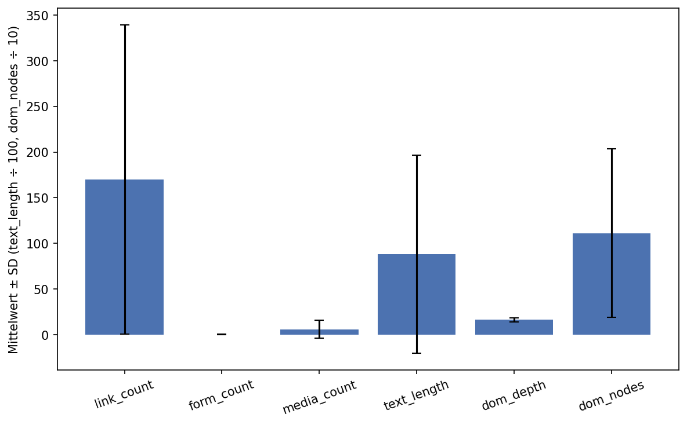
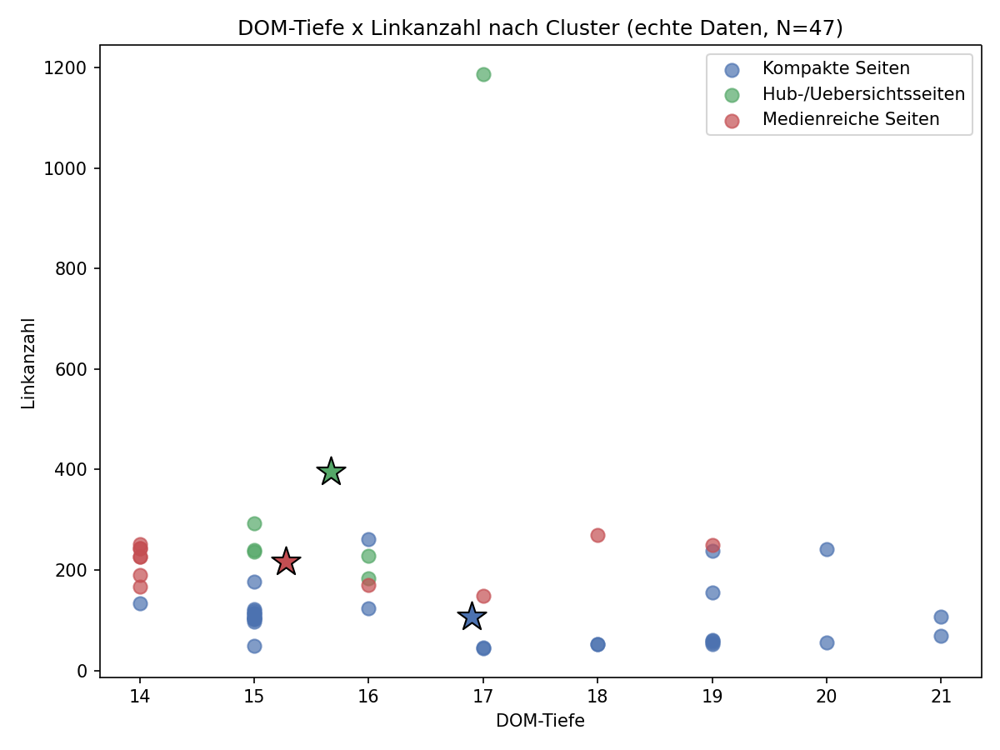

# Automatisierte Analyse struktureller Webkomplexität: Merkmalsextraktion und Klassifikation gecrawlter Webseiten

**Jonas Kimmer**
**[BITTE VOR ABGABE ERGÄNZEN: Hochschule · Studiengang · Matrikelnummer · Betreuer:in · Abgabedatum]** · 2026

---

## Zusammenfassung

Automatisierte Verfahren zur Einschätzung von Website-Komplexität beschränken sich meist auf Einzelmetriken und sind selten offen anpassbar. Diese Arbeit untersucht, ob sich die strukturelle Komplexität einzelner Webseiten automatisiert messen und klassifizieren lässt, und ob ein mehrdimensionales Merkmalsmodell dabei mehr leistet als eine Einzelmetrik. Auf Basis selbst gecrawlter, ungerenderter HTML-Daten von drei öffentlichen Websites (bpb.de, hs-rm.de, wiesbaden.de; N = 47 Unterseiten) extrahierte ein modulares Analyse-Tool sechs strukturelle Merkmale je Seite.

Ein K-Means-Clustering (k = 3) erzielt einen Silhouette-Score von 0,433 (Bootstrap-95-%-CI [0,380; 0,566]) und ist nur teilweise mit der Website-Zugehörigkeit konfundiert (ARI = 0,243). Eine Reihe von Robustheitsprüfungen relativiert das mehrdimensionale Modell mehrfach: Die gewählte Cluster-Anzahl ist nicht datenoptimal (k = 6 erzielt einen höheren Score); die Einzelmetrik `link_count` clustert intern besser (0,667) als das Sechs-Merkmale-Modell — auch nach Dekorrelation redundanter Merkmale (0,500, mit einem Single-Page-Ausreißercluster); die scheinbare Bedeutung zweier Merkmale erweist sich unter Permutation als Methodenartefakt; und die 5-fache Cross-Validation liegt mit 83,1 % deutlich unter dem optimistischen Einzel-Split (100 %; stratifiziert 93,6 %). Ein unabhängiges externes Kriterium — die HTTP-Antwortzeit, deren Einzelmessungen nicht archiviert wurden — bestätigt weder Clusterstruktur noch die wichtigsten Merkmale. Die Forschungsfrage ist damit im Sinne technischer Machbarkeit zu bejahen, im Sinne einer robusten, mehrwertigen und extern validierten Komplexitätsmessung jedoch nicht. Alle Kennzahlen sind, mit Ausnahme der Antwortzeit-Rohdaten, aus dem versionskontrollierten Projekt reproduzierbar.

**Schlüsselwörter:** Webkomplexität, DOM-Analyse, HTML-Parsing, Clustering, Feature-Extraktion, Permutation-Importance, Cross-Validation

---

## Abbildungsverzeichnis

- **Abbildung 1:** Merkmalsverteilungen über alle 47 Seiten (Abschnitt 4.1)
- **Abbildung 2:** DOM-Tiefe × Linkanzahl nach Cluster (Abschnitt 4.2)

## Tabellenverzeichnis

- **Tabelle 1:** Merkmalsverteilung, N = 47 Seiten (Abschnitt 4.1)
- **Tabelle 2:** Cluster-Charakteristika (Abschnitt 4.2)
- **Tabelle 3:** Cluster-Verteilung nach Website (Abschnitt 4.2)
- **Tabelle 4:** Klassifikationsgenauigkeit — Einzel-Split vs. Cross-Validation (Abschnitt 4.3)
- **Tabelle 5:** Feature-Importance: MDI vs. Permutation (Abschnitt 4.3)
- **Tabelle 6:** Merkmals-Mittelwerte je Website (Abschnitt 4.4)
- **Tabelle 7:** Korrelation Antwortzeit × Strukturmerkmale (Abschnitt 4.6)
- **Tabelle 8:** Antwortzeit nach Cluster und Website (Abschnitt 4.6)

---

## 1. Einleitung

### 1.1 Motivation und Problemstellung

Websites unterscheiden sich in ihrer strukturellen Komplexität teils stark: Einfache Landingpages stehen neben umfangreichen Portalen mit tiefen DOM-Hierarchien und vielfältigen interaktiven Elementen. Diese Unterschiede werden in der Praxis häufig mit Ladezeiten, Barrierefreiheit, Wartbarkeit und Nutzererfahrung in Verbindung gebracht; eine objektive, über Websites hinweg vergleichbare Einschätzung ist für Webentwickler, UX-Designer und Qualitätssicherungsteams daher wertvoll. Ob dieser Zusammenhang für die hier erhobenen Strukturmerkmale empirisch zutrifft, wird im Rahmen dieser Arbeit anhand eines unabhängigen Performanzkriteriums geprüft.

Die manuelle Bewertung von Website-Komplexität ist aufwendig, subjektiv und schlecht skalierbar; ein Vergleich über mehrere Websites oder über Zeit ist so kaum möglich. Automatisierte Ansätze beschränken sich zudem häufig auf Einzelmetriken wie die Seitenanzahl, ohne DOM-Tiefe oder die Verteilung interaktiver Elemente zu berücksichtigen — ob eine mehrdimensionale Merkmalsanalyse dieser Einzelmetrik tatsächlich überlegen ist, ist die zentrale empirische Frage dieser Arbeit. Viele bestehende Analyse-Tools sind zudem proprietär, cloudbasiert und nicht anpassbar. Ein offenes, modulares Werkzeug fehlt bislang.

### 1.2 Zielsetzung

Diese Arbeit verfolgt zwei Ziele: Erstens wird ein modulares Analyse-Tool vorgestellt, das gecrawlte Website-Daten automatisch einliest und pro Seite strukturelle Merkmale extrahiert. Zweitens wird geprüft, ob diese Merkmale ausreichen, um Seitentypen automatisch zu klassifizieren, und ob dieser Merkmalsvektor einer einfachen Einzelmetrik-Heuristik tatsächlich überlegen ist.

> _Lässt sich die strukturelle Komplexität einzelner Webseiten anhand automatisiert extrahierter Merkmale messen und klassifizieren, ohne manuelle Annotation, und bietet ein mehrdimensionales Merkmalsmodell dabei einen belastbaren Mehrwert gegenüber einer Einzelmetrik?_

Drei Nebenfragestellungen schärfen sie:

1. **Merkmalsrelevanz:** Welche Merkmale sind die stärksten Komplexitätsindikatoren, und hält diese Einordnung einer methodenkritischen Prüfung stand?
2. **Modellierung:** Ist die gewählte Cluster-Anzahl datengetrieben begründbar?
3. **Externe Validität:** Korrespondiert die datengetriebene Clusterstruktur mit einem unabhängigen, praktisch relevanten Performanzkriterium (HTTP-Antwortzeit)?

---

## 2. Stand der Technik

Webkomplexität ist kein einheitlich definiertes Konzept. Die breiteste empirische Grundlage stammt von Ivory und Hearst (2002), die 157 quantitative Maße untersuchten — von Text-, Link- und Grafikelementen über Formatierung bis zur Seiten- und Site-Architektur — und belegten, dass sich solche automatisiert berechenbaren Seitenmerkmale als Prädiktoren für die von Expert:innen wahrgenommene Seitenqualität eignen. Zu den am leichtesten erfassbaren zählen Strukturmerkmale des Document Object Model (DOM): Seine Baumstruktur lässt sich durch rekursives Traversieren des HTML-Quelltexts effizient ausmessen, Tiefe und Knotenanzahl gelten als zentrale Indikatoren struktureller Komplexität.

Die automatische Klassifikation von Webseiten nach Typ oder Funktion ist ein bekanntes Anwendungsfeld im Web Mining; Qi und Davison (2009) geben einen Überblick über die dabei verwendeten Merkmalsfamilien (Inhalt, Links, Struktur, URL) und Verfahren. Unüberwachte Verfahren wie K-Means-Clustering eignen sich besonders, wenn Seitentypen erst aus den Daten heraus identifiziert werden sollen.

Random-Forest-Klassifikatoren haben sich für tabellarische Feature-Matrizen als robuste Methode bewährt (Breiman, 2001). Ihre Feature-Importance lässt Rückschlüsse darauf zu, welche Merkmale die Klassifikation primär tragen. Werden die Labels jedoch durch ein vorheriges Clustering erzeugt, quantifiziert die Importance nur die interne Konsistenz der Clusterstruktur, nicht die externe Validität gegenüber einer unabhängigen Zielvariable. Zudem ist die Standard-Feature-Importance von Random Forests (Mean Decrease Impurity) bekanntermaßen zugunsten kontinuierlicher Merkmale mit vielen eindeutigen Werten verzerrt; Permutation-Importance gilt als robusteres Gegenstück (vgl. 4.3).

Messwertbasierte Arbeiten zur Website-Komplexität sind der direkteste Bezugspunkt dieser Studie: Butkiewicz et al. (2011) entwickelten aus Messungen realer Seiten Metriken für Inhalts- und Strukturkomplexität und untersuchten deren Zusammenhang mit der Ladeperformance — genau die Kombination aus Strukturmerkmalen und Außenkriterium, die in 4.6 geprüft wird. Ihre Befunde legen nahe, dass Seitenkomplexität mehrdimensional erfasst werden sollte; ob die hier gewählten sechs DOM-Merkmale diesen Anspruch einlösen, ist eine empirische Frage der Abschnitte 4.5 und 4.6. Chen (2018) vertritt demgegenüber den Outdegree einer Seite als alleiniges Komplexitätsmaß und optimiert Website-Struktur durch Link-Reduktion — ein Einzelmetrik-Ansatz, gegen den das hier geprüfte mehrdimensionale Modell direkt anzutreten hat.

Jenseits der Strukturmerkmale untersucht die HCI-Forschung die _wahrgenommene_ Komplexität: Tuch et al. (2012) zeigen experimentell, dass visuelle Komplexität und Prototypikalität die Ersturteile von Nutzenden prägen, und Miniukovich und De Angeli (2014) operationalisieren visuelle Komplexität rechnerisch. Struktur- und Wahrnehmungsmaße laufen damit nebeneinander; ob sie dieselbe zugrundeliegende Dimension erfassen, ist ohne Erhebung von Nutzurteilen nicht entscheidbar (vgl. 5.3). Schließlich ist das Web selbst hochdynamisch: Ntoulas et al. (2004) messen, dass ein erheblicher Teil der Seiten wöchentlich neu entsteht oder sich wesentlich verändert — jede strukturelle Erhebung, auch die vorliegende, ist damit prinzipiell eine Momentaufnahme (vgl. 5.3).

---

## 3. Methodik

### 3.1 Datenbasis

Die Webcrawler-Daten wurden im Rahmen dieser Arbeit selbst erhoben. Der Beitrag umfasst die Entwicklung eines modularen Analyse-Tools (Python/Streamlit), einen begleitenden robots.txt-konformen Crawler zur Datenerhebung sowie die statistische Auswertung. Eine ursprünglich an drei anderen Websites durchgeführte Erhebung musste aufgrund nicht mehr verfügbarer Rohdaten durch die hier beschriebene Neuerhebung ersetzt werden; alle Ergebnisse in Kapitel 4 beziehen sich ausschließlich auf diese Neuerhebung.

Die Analyse basiert auf drei gecrawlten Websites mit insgesamt 47 Unterseiten: das redaktionelle Informationsportal bpb.de der Bundeszentrale für politische Bildung (20 Unterseiten), die Hochschul-Website hs-rm.de mit flacher Navigationsstruktur (15 Unterseiten) und das Bürger- und Verwaltungsportal wiesbaden.de (12 Unterseiten).

Der Crawler (`mini_crawler.py`, im Projekt versionskontrolliert) arbeitet mit Breite-zuerst-Suche (FIFO-Warteschlange) innerhalb derselben Domain, respektiert die `robots.txt`-Disallow-Pfade des User-Agents und hält einen Abstand von 1 s zwischen Requests ein. Die drei Crawls umfassen 20, 15 bzw. 12 Seiten; ob die Seitenzahl bei wiesbaden.de durch das Aufruf-Limit oder durch eine erschöpfte Warteschlange nach dem Überspringen von URLs (robots.txt, Nicht-HTML-Inhalte, Abruffehler) zustande kam, ist aus den Artefakten nicht mehr rekonstruierbar. Die Analyse basiert auf dem ungerenderten HTML: Seiteninhalt wird per einfachem HTTP-GET ohne JavaScript-Ausführung abgerufen und mit BeautifulSoup geparst. Screenshots entstehen separat per Playwright/Chromium und fließen nicht in die Merkmale ein. Die Crawl-Artefakte tragen laut Dateisystem-Metadaten den Erhebungszeitpunkt 8. August 2026. Pro Seite wurden HTML-Quelltext, sichtbarer Text, Linkstruktur, Formulare und Medienelemente als strukturierte JSON-Dateien gespeichert.

Da nur statische HTML-Snapshots erfasst werden, fehlen dynamisch per JavaScript nachgeladene Inhalte. Dies tritt konkret an zwei Stellen zutage: Bei bpb.de fand sich für keine der 20 Seiten ein ``-Tag im statischen HTML (`media_count` ist dadurch durchgängig 0), eine Stichprobenprüfung des Rohquelltexts bestätigt, dass die Bilder client-seitig nachgeladen werden. Bei wiesbaden.de fand sich auf keiner Seite ein `<form>`-Element; eine Stichprobenprüfung des gespeicherten Roh-HTML zeigt, dass die Seite zur Personalausweis-Beantragung nur die Dienstleistung beschreibt und auf ein externes, nicht miterfasstes Verwaltungsportal verlinkt, auf dem das eigentliche Formular liegt (im Rohquelltext findet sich dazu der Marker `"citygovOnlineService"`; ein strukturiertes Metadatenfeld existiert nicht). Beide sind reale Messartefakte der Methode, nicht des Merkmals an sich (vgl. 5.2). Die drei Websites wurden nach öffentlicher Zugänglichkeit und unproblematischer robots.txt-Erlaubnis ausgewählt (vgl. 5.3 zum daraus resultierenden Selektionsbias).

### 3.2 Tool, Merkmale und Analyseverfahren

Das Analyse-Tool ist in Python implementiert (Streamlit-Oberfläche), liest Website-Ordner mit strukturierten JSON-Repräsentationen des DOM ein und entkoppelt Loader und Feature-Berechnung über typisierte Datenklassen. Pro Seite werden sechs strukturelle Merkmale berechnet:

| Merkmal     | Beschreibung                                                                 |
| ----------- | ---------------------------------------------------------------------------- |
| link_count  | Anzahl aller Link-Elemente (`<a href>`) der Seite, inkl. interner Navigation |
| form_count  | Anzahl `<form>`-Elemente                                                     |
| media_count | Anzahl Medienelemente (Bilder, Videos)                                       |
| text_length | Zeichenanzahl des sichtbaren Texts                                           |
| dom_depth   | Maximale Tiefe des DOM-Baums                                                 |
| dom_nodes   | Gesamtanzahl der DOM-Knoten                                                  |

**Clustering:** K-Means (k = 3) auf z-standardisierten Merkmalen. Zusätzlich ein k-Scan über k = 2–6 (Silhouette-Score je k), um zu prüfen, ob k = 3 tatsächlich optimal ist. Clusterqualität über Silhouette-Score (Rousseeuw, 1987: >0,5 gilt als gut) sowie ein Bootstrap (1.000 Resamples) zur Unsicherheitsschätzung.

**Website-Konfundierung:** Adjusted Rand Index (ARI; Hubert & Arabie, 1985) zwischen Cluster- und Website-Zugehörigkeit (0 = keine Übereinstimmung über Zufallsniveau, 1 = identisch).

**Feature-Importance:** Random-Forest (100 Bäume, `random_state=42`) auf den Cluster-Labels, ausgewertet über Mean Decrease Impurity (MDI, verzerrt zugunsten kontinuierlicher Merkmale) und Permutation-Importance (30 Wiederholungen, `random_state=42`). Klassifikationsgüte über einen einzelnen 75/25-Split (`train_test_split`, `random_state=42`, ohne Schichtung — mit `stratify` ergäbe sich für denselben Seed 0,833 statt 1,000, der Aufruf ist daher vollständig dokumentiert) sowie 5-fache Cross-Validation.

**Cluster-Stabilität:** Die K-Means-Lösung (`random_state=42`, `n_init=10`) wurde gegen 50 Wiederholungen mit anderen Zufallssaaten verglichen (ARI zur Referenzlösung; Saaten aus `default_rng(0)` im Bereich 1–100.000, damit reproduzierbar). Dieser Check prüft nur algorithmische Konsistenz, nicht inhaltliche Korrektheit.

**Baseline-Vergleich:** K-Means (k = 3) nur auf dem z-standardisierten Merkmal `link_count`, verglichen (Silhouette, ARI) mit dem Sechs-Merkmale-Clustering. Zwei weitere Varianten prüfen die Robustheit zusätzlich: eine log1p-transformierte Merkmalsmenge (gegen Rechtsschiefe) und eine dekorrelierte Teilmenge (gegen Merkmalsredundanz).

**Externes Kriterium (Antwortzeit):** Für alle 47 Seiten wurde die Antwortzeit eines HTTP-GET-Requests gemessen (3 Wiederholungen, Median). Dies erfasst nur die Serverantwortzeit und die HTML-Übertragungsdauer, nicht die vollständige, browserseitige Ladezeit. Dennoch ist die Antwortzeit ein von den sechs Strukturmerkmalen unabhängiges Kriterium.

**Reproduzierbarkeit:** Alle Kennzahlen der Tabellen 1–6 sowie k-Scan, Baseline, Dekorrelation, Log-Transform-Variante, stratifizierte CV mit balancierter Accuracy, Importance, Bootstrap und Stabilität erzeugt das Skript `check_web_analysis.py` aus der versionierten Merkmalsdatei `new_web_features.csv` (die ihrerseits exakt der Tool-Pipeline aus den Crawl-Artefakten entspricht); auch beide Abbildungen werden dort erzeugt. Seed-abhängige Größen (Stabilität, Permutation) können sich bei anderen Saaten leicht verschieben.

---

## 4. Ergebnisse

### 4.1 Merkmalsverteilung über alle Seiten

**Tabelle 1: Merkmalsverteilung (N = 47 Seiten)**

| Merkmal     | M     | SD     | Min   | Max    |
| ----------- | ----- | ------ | ----- | ------ |
| link_count  | 170,0 | 169,3  | 44    | 1.187  |
| form_count  | 0,19  | 0,45   | 0     | 2      |
| media_count | 6,02  | 9,60   | 0     | 35     |
| text_length | 8.792 | 10.845 | 1.258 | 54.453 |
| dom_depth   | 16,36 | 2,10   | 14    | 21     |
| dom_nodes   | 1.111 | 923    | 521   | 4.733  |

**Abbildung 1: Merkmalsverteilungen über alle 47 Seiten**

_Mittelwert ± SD der sechs Merkmale (text_length ÷ 100, dom_nodes ÷ 10 für Darstellbarkeit)._

Die Fehlerbalken von `link_count` und `text_length` überdecken einen Großteil des Wertebereichs, während `dom_depth` sichtbar kompakt bleibt. Die Verteilungen zeigen extreme Rechtsschiefe bei `link_count` und `text_length`, denn einzelne Übersichtsseiten von bpb.de (bis zu 1.187 Links) treiben Mittelwert und SD deutlich über das Niveau der übrigen Seiten. `form_count` liegt nahe null (M 0,19), eine Folge des Formular-Erfassungsproblems bei wiesbaden.de (3.1). `media_count` ist dagegen durch den bpb.de-Artefakt (durchgängig 0) nach unten verzerrt; der Mittelwert von 6,02 stammt praktisch vollständig von hs-rm.de.

### 4.2 Clustering: Automatisch identifizierte Seitentypen

Die K-Means-Analyse (k = 3) ergab drei Cluster mit einem Silhouette-Score von 0,433, unterhalb der 0,5-Schwelle für einen "guten" Trennungswert (zur Robustheit dieses Werts vgl. 4.5).

**Tabelle 2: Cluster-Charakteristika (Mittelwerte je Cluster)**
_(Cluster-Zugehörigkeit ist mit Website-Zugehörigkeit teilweise konfundiert, ARI = 0,243. Siehe Tabelle 3.)_

| Cluster | N   | Links M | DOM-Tiefe M | Text M   | Medien M | Typ (post-hoc)        |
| ------- | --- | ------- | ----------- | -------- | -------- | --------------------- |
| 0       | 30  | 107,7   | 16,9        | 4.084,6  | 2,2      | Kompakte Seiten       |
| 1       | 6   | 395,0   | 15,7        | 28.589,2 | 0,0      | Hub-/Übersichtsseiten |
| 2       | 11  | 217,3   | 15,3        | 10.831,3 | 19,6     | Medienreiche Seiten   |

Die Bezeichnungen wurden post-hoc vergeben und sind als analytische Hilfsbegriffe zu verstehen, nicht als validierte Kategorien. Da `link_count` auch interne Navigation enthält (3.2), können hohe Werte sowohl inhaltliche Vielfalt als auch umfangreiche Navigations-/Footer-Strukturen abbilden — die Typisierung "Hub-/Übersichtsseiten" trägt diese Mehrdeutigkeit mit. Es ergibt sich kein Cluster mit hohem `form_count`, eine direkte Folge des Formular-Erfassungsartefakts.

**Tabelle 3: Cluster-Verteilung nach Website**

| Website      | Cluster 0 | Cluster 1 | Cluster 2 | Gesamt |
| ------------ | --------- | --------- | --------- | ------ |
| bpb.de       | 14        | 6         | 0         | 20     |
| hs-rm.de     | 4         | 0         | 11        | 15     |
| wiesbaden.de | 12        | 0         | 0         | 12     |
| **Gesamt**   | **30**    | **6**     | **11**    | **47** |

Der ARI von 0,243 zeigt eine reale, aber nur partielle Konfundierung: Cluster 1 besteht ausschließlich aus 6 bpb.de-Seiten und Cluster 2 ausschließlich aus 11 hs-rm.de-Seiten — beide sind faktisch mit einer Website identisch —, während nur Cluster 0 alle drei Websites vereint (14 bpb, 4 hs-rm, 12 wiesbaden). Eine pauschale Formulierung wie "kein reines Website-Artefakt" würde das verschleiern.

**Abbildung 2: DOM-Tiefe × Linkanzahl nach Cluster**

_Scatter-Plot der 47 Seiten, eingefärbt nach Cluster. ★ markiert das jeweilige Clusterzentrum._

Die beiden website-reinen Cluster bilden im Zentrum klar getrennte Punktwolken, die sich in den Randbereichen überlappen; Cluster 0 verteilt sich über weite Teile des Diagramms.

### 4.3 Feature-Importance und Klassifikationsgüte

**Tabelle 4: Klassifikationsgenauigkeit — Einzel-Split vs. Cross-Validation**

| Verfahren                 | Genauigkeit                           |
| ------------------------- | ------------------------------------- |
| Einzelner 75/25-Split     | 1,000                                 |
| 5-fache CV (Mittelwert)   | 0,831 (SD 0,207)                      |
| 5-fache CV (Einzel-Folds) | 1,000 / 0,600 / 0,556 / 1,000 / 1,000 |

Der Einzel-Split-Wert überschätzt die tatsächliche Robustheit erheblich, da einzelne CV-Folds auf 55,6 % zurückfallen (SD 20,7 Punkte bei N = 47). Eine stratifizierte Variante (StratifiedKFold, 5 Folds, Seed 42) liefert 0,889–1,000 mit einem Mittel von 0,936 und einer balancierten Accuracy von 0,928 — die schwachen unstratifizierten Folds spiegeln also vor allem die Cluster-Unbalanciertheit (30/6/11) in einzelnen Folds wider, nicht unbedingt eine fragile Trennung. Die Cluster-Labels sind aus den Merkmalen überwiegend rekonstruierbar, der Einzel-Split-Wert von 1,000 bleibt gleichwohl eine optimistische Punktschätzung.

**Tabelle 5: Feature-Importance — MDI vs. Permutation-Importance** _(Reproduktion: `check_web_analysis.py`; Permutation mit dokumentiertem Seed)_

| Merkmal     | MDI   | Permutation-Importance |
| ----------- | ----- | ---------------------- |
| dom_nodes   | 0,254 | 0,099                  |
| media_count | 0,180 | 0,056                  |
| link_count  | 0,225 | 0,054                  |
| form_count  | 0,086 | 0,005                  |
| text_length | 0,176 | **0,000**              |
| dom_depth   | 0,078 | **0,000**              |

`text_length` (MDI 17,6 %) und `dom_depth` (MDI 7,8 %) erscheinen unter MDI als relevant, ihre Permutation-Importance beträgt jedoch 0,000. Bei `text_length` ist dies plausibel auf den klassischen MDI-Kardinalitätsbias zurückzuführen, weil ein Entscheidungsbaum bei Merkmalen mit vielen unterschiedlichen Werten (fast 47 verschiedene bei `text_length`) leichter einen zufällig gut passenden Schnittpunkt findet als bei Merkmalen mit wenigen Werten. `dom_depth` hat mit nur 8 unterschiedlichen Werten (14–21) jedoch eine noch geringere Kardinalität als `form_count` (0–2), trotzdem liegt `form_count` mit MDI 8,6 % höher als `dom_depth` mit 7,8 % — der Kardinalitätsbias erklärt den `dom_depth`-Wert also nur unvollständig. Wahrscheinlicher trägt hier zusätzlich die schwache Streuung von `dom_depth` selbst bei (SD 2,1 bei einem Range von nur 7), was dem Random Forest kaum trennende Schnittpunkte liefert und die MDI-Zuweisung instabil macht. Permutation-Importance misst dagegen direkt, was passiert, wenn ein Merkmal wertlos gemacht wird, und entgeht diesem Bias unabhängig von seiner genauen Ursache. `dom_nodes` und `link_count` bleiben unter beiden Methoden am wichtigsten.

Die Korrelationsmatrix liefert eine Erklärung für die MDI-Dominanz, denn `link_count` korreliert mit `text_length` (r = 0,81) und mit `dom_nodes` (r = 0,72). Diese drei Merkmale bilden also überwiegend eine gemeinsame "Umfang"-Dimension statt drei unabhängiger Dimensionen. `dom_depth` korreliert mit keinem anderen Merkmal nennenswert (|r| ≤ 0,28), konsistent mit seiner Permutation-Importance von 0,000.

### 4.4 Website-Vergleich auf Aggregatniveau

**Tabelle 6: Merkmals-Mittelwerte je Website**

| Merkmal       | bpb.de (N=20) | hs-rm.de (N=15) | wiesbaden.de (N=12) |
| ------------- | ------------- | --------------- | ------------------- |
| link_count M  | 206,6         | 210,5           | 58,6                |
| form_count M  | 0,0           | 0,6             | 0,0                 |
| media_count M | 0,0           | 18,3            | 0,8                 |
| text_length M | 11.639,6      | 9.813,7         | 2.768,2             |
| dom_depth M   | 15,3          | 16,0            | 18,6                |
| dom_nodes M   | 1.461,2       | 998,7           | 668,3               |

Keine der drei Websites ist in allen sechs Merkmalen führend: bpb.de hat die höchste Textmenge und DOM-Knotenanzahl, hs-rm.de die höchste Linkanzahl, wiesbaden.de die größte DOM-Tiefe. Das Profil von wiesbaden.de — geringste Knotenzahl (668) bei gleichzeitig höchster DOM-Tiefe (18,6) — wird in 5.1 als eigenständiger Befund zur Mehrdimensionalität von Komplexität eingeordnet. Die `media_count`-Werte von bpb.de und die `form_count`-Werte von wiesbaden.de sind durch die in 3.1 beschriebenen Erfassungsartefakte nach unten verzerrt und nicht als reale Abwesenheit zu lesen.

### 4.5 Robustheitsprüfungen: k-Wahl, Stabilität, Baseline

**k-Scan (k = 2–6):**

| k               | Silhouette-Score |
| --------------- | ---------------- |
| 2               | 0,466            |
| **3 (gewählt)** | **0,433**        |
| 4               | 0,446            |
| 5               | 0,436            |
| 6               | 0,480            |

k = 3 liefert nicht den höchsten Score, k = 6 schneidet besser ab. Die Wahl ist primär durch Vergleichbarkeit mit der dreiteiligen Datenbasis motiviert, nicht durch datengetriebene Optimierung — diese Einschränkung wird hier explizit gemacht statt verschwiegen.

**Cluster-Stabilität:** Über 50 Wiederholungen mit dokumentierten Zufallssaaten (aus `default_rng(0)`) ergibt sich ein mittlerer ARI von 0,986 (Minimum 0,717). Die Lösung ist algorithmisch sehr stabil und, anders als die k-Wahl, kein Zufallsartefakt.

**Silhouette-Bootstrap:** 1.000 Resamples ergeben einen Mittelwert von 0,472, 95-%-CI [0,380, 0,566]. Der Punktschätzer 0,433 liegt am unteren Rand; die "gut"-Schwelle von 0,5 wird auch im Bootstrap-Mittel nicht sicher erreicht.

**Baseline-Vergleich:** Clustering nur auf `link_count` erzielt einen Silhouette-Score von 0,667, deutlich höher als das Sechs-Merkmale-Modell (0,433). Beide Lösungen stimmen nur mäßig überein (ARI = 0,527). In dieser Stichprobe erzeugt die Einzelmetrik eine klarer abgegrenzte Clusterstruktur als der vollständige Merkmalsvektor.

**Dekorrelations-Analyse:** Die Korrelationsmatrix legt nahe, dass drei der sechs Merkmale überwiegend dieselbe "Umfang"-Dimension messen. Wird das Clustering auf den dekorrelierten Satz `link_count`, `dom_depth`, `media_count`, `form_count` beschränkt, steigt der Silhouette-Score von 0,433 auf 0,500 — die "gut"-Schwelle wird knapp erreicht, die Lösung bleibt der 6-Merkmal-Lösung strukturell ähnlich (ARI = 0,717), zur `link_count`-Baseline dagegen deutlich verschieden (ARI = 0,339). Zwei Einschränkungen trüben das Ergebnis: Erstens bleibt auch 0,500 unterhalb der Einzelmetrik-Baseline (0,667). Zweitens isoliert die dekorrelierte Lösung die extremste bpb.de-Seite (1.187 Links, 54.453 Zeichen) als Single-Page-Cluster (Clustergrößen 35/11/1); ein Teil des Silhouette-Gewinns stammt damit aus Ausreißerisolierung, nicht aus sauber getrennten inhaltlichen Gruppen. Das Ergebnis verfeinert die Schlussfolgerung, dreht sie aber nicht.

**Log-Transform-Variante:** Auf log1p-transformierten, z-standardisierten Merkmalen (gegen die Rechtsschiefe von `link_count` und `text_length`) steigt der Silhouette-Score nur leicht auf 0,462 (ARI 0,609 zur untransformierten Lösung); auch die `link_count`-Baseline bleibt unter Log-Transformierung bei 0,667. Die Rechtsschiefe erklärt damit praktisch nichts des Baseline-Vorteils — das zentrale Robustheitsproblem ist die Merkmalsredundanz, nicht die Verteilungsform.

### 4.6 Externes Kriterium: Zusammenhang mit realer Antwortzeit

Alle bisherigen Kennzahlen bewerten, wie gut die sechs Merkmale sich selbst erklären. Das ist ein internes Gütekriterium. Als unabhängige Gegenprobe wurde die HTTP-Antwortzeit aller 47 Seiten gemessen und gegen Strukturmerkmale und Clusterzugehörigkeit getestet.

_Provenienz-Hinweis: Die Einzelmessungen (3 Wiederholungen je Seite, Median) wurden seinerzeit nicht als Datei archiviert und sind nicht mehr auffindbar; die folgenden Werte stammen aus der verlorenen Messung und lassen sich aus dem Projektstand nicht erneut prüfen. Sie werden der Vollständigkeit halber berichtet und als nicht reproduzierbar gekennzeichnet (vgl. Verfügbarkeitsstatement)._

**Tabelle 7: Korrelation Antwortzeit × Strukturmerkmale**

| Merkmal     | r      | p         |
| ----------- | ------ | --------- |
| dom_depth   | 0,289  | **0,049** |
| link_count  | −0,199 | 0,179     |
| media_count | −0,191 | 0,200     |
| text_length | −0,188 | 0,206     |
| dom_nodes   | −0,184 | 0,216     |
| form_count  | 0,147  | 0,325     |

Nur `dom_depth` weist einen schwachen, gerade noch signifikanten Zusammenhang auf. Bei sechs getesteten Korrelationen ist ein zufälliges p < 0,05 jedoch nicht unwahrscheinlich; nach Bonferroni-Korrektur (α = 0,05/6 ≈ 0,0083) wäre auch dieser Wert nicht mehr signifikant. Der Befund ist daher als schwaches, unkorrigiertes Signal zu lesen, nicht als abgesicherter Effekt. Die beiden Merkmale mit der höchsten Permutation-Importance (`dom_nodes`, `link_count`) korrelieren ohnehin nicht signifikant mit der Antwortzeit (p = 0,216 bzw. 0,179).

**Tabelle 8: Antwortzeit nach Cluster und Website**

| Gruppe                            | M (s) | SD    | N   |
| --------------------------------- | ----- | ----- | --- |
| Cluster 0 (Kompakte Seiten)       | 0,133 | 0,065 | 30  |
| Cluster 1 (Hub-/Übersichtsseiten) | 0,093 | 0,008 | 6   |
| Cluster 2 (Medienreiche Seiten)   | 0,114 | 0,071 | 11  |
| bpb.de                            | 0,102 | 0,041 | 20  |
| hs-rm.de                          | 0,106 | 0,061 | 15  |
| wiesbaden.de                      | 0,182 | 0,064 | 12  |

Zwischen den drei Clustern ist der Unterschied nicht signifikant (ANOVA, F = 1,17, p = 0,319). Auf Website-Ebene ist wiesbaden.de im Mittel langsamer, was eher mit der Server-/Infrastrukturseite als mit den HTML-Strukturmerkmalen zusammenhängen dürfte. Das einzige herangezogene externe, von den Input-Merkmalen unabhängige Kriterium liefert damit keine Bestätigung dafür, dass Clusterstruktur oder die wichtigsten Strukturmerkmale mit einem praktisch relevanten Außenkriterium zusammenhängen.

---

## 5. Diskussion

### 5.1 Strukturelle Merkmale als Komplexitätsindikatoren

Dass gerade `link_count` und `dom_nodes` die Cluster tragen, passt zum Befund von Ivory und Hearst (2002), dass quantitative Struktur- und Linkmerkmale prädiktiv für die wahrgenommene Seitenqualität sind. Dass zwei andere, unter MDI relevant erscheinende Merkmale sich bei genauerer Prüfung als wertlos erweisen (4.3), zeigt dagegen den eigentlichen methodischen Ertrag dieser Arbeit — eine unreflektierte Feature-Importance-Analyse hätte hier in die Irre geführt. Die Dekorrelations-Analyse (4.5) präzisiert das Bild: Der Informationsgewinn der sechs Merkmale ist in dieser Stichprobe real, aber geringer als ihre Redundanz — drei von sechs messen im Wesentlichen denselben "Umfang". Ein schlankeres Merkmalsset (vier statt sechs, ohne die beiden redundanten Umfangs-Indikatoren) wäre der Ausgangspunkt für ähnliche Analysen — mit dem Vorbehalt aus 4.5, dass gerade diese Vier-Merkmale-Lösung die extremste Seite als Single-Page-Cluster isoliert; die Empfehlung ist damit vorläufig, bis sie an einem größeren Seitenkorpus geprüft ist.

Das in 4.4 berichtete Strukturprofil von wiesbaden.de — schlank im Umfang, aber die tiefste DOM-Verschachtelung — illustriert, dass "Komplexität" kein eindimensionales Konstrukt ist: Eine Website kann in der Umfangsdimension minimal und in der Verschachtelungstiefe gleichzeitig maximal sein. Das passt zu funktionalen Verwaltungsdienstleistungsseiten, die wenige Inhalte, aber mehrstufige Layout- und Navigationscontainer verschachteln, und erklärt, warum `dom_depth` als einziges Merkmal bei wiesbaden.de heraussticht, obwohl die Website im "Umfang" am kleinsten ist. Genau solche Profile, nicht die Gesamtlage im Umfangsraum, wären der interessante Gegenstand einer Folgestudie mit mehr Websites. Butkiewicz et al. (2011) argumentieren in dieselbe Richtung: Sinnvolle Komplexitätsmessung kombiniert mehrere, voneinander unabhängige Metrikfamilien mit einem Außenkriterium — genau die Kombination, die hier versuchsweise umgesetzt wurde, deren Außenkriterium (Antwortzeit) aber zu grob geriet, um Strukturunterschiede aufzulösen (4.6). Dass ausgerechnet `link_count` als Einzelmetrik am tragfähigsten bleibt, fügt sich zudem zu Chens (2018) Outdegree-basiertem Ansatz — die Einzelmetrik ist offenbar nicht nur ein statistischer Notbehelf, sondern trägt reale Strukturinformation.

### 5.2 Grenzen und Verallgemeinerbarkeit

Die beiden Erfassungslücken aus 3.1 unterscheiden sich in der Ursache, nicht nur im Ergebnis: bei bpb.de ein Rendering-Problem (clientseitiges Nachladen), bei wiesbaden.de ein Scope-Problem (Formular außerhalb der gecrawlten Domain). Für die Praxis folgt daraus, dass ein Crawler-Tool dieser Art eine leere Merkmalsauszählung nicht kommentarlos als Nullwert ausgeben sollte, sondern die wahrscheinliche Ursache mit ausweisen müsste. Ob die gefundenen Cluster-Typen auf andere Websitegattungen (E-Commerce, Social Media) übertragbar sind, bleibt offen. Die modulare Architektur erlaubt aber die Erweiterung um weitere Merkmale ohne strukturellen Umbau.

### 5.3 Einschränkungen

**Externes Kriterium und Website-Konfundierung:** Das einzige geprüfte externe Kriterium (4.6) bestätigt weder Clusterzugehörigkeit noch die wichtigsten Merkmale; seine Einzelmessungen wurden zudem nicht archiviert und es deckt nur einen Ausschnitt möglicher Außenkriterien ab. Insbesondere die _wahrgenommene_ Komplexität, die Tuch et al. (2012) und Miniukovich und De Angeli (2014) als eigenständige, verhaltensrelevante Dimension belegen, wurde nicht erhoben — ob die strukturellen Merkmale abbilden, was Nutzende unter Komplexität verstehen, bleibt damit offen. Mit nur 3 Websites (47 Beobachtungen, die in drei Websites genestet statt unabhängig sind, ARI = 0,243) lässt sich zudem nicht sicher zwischen "generalisierbarem Seitentyp" und "individueller Website-Eigenheit" trennen.

**Stichprobenauswahl:** Die drei Websites wurden nach unproblematischer robots.txt-Erlaubnis ausgewählt, eine Positivselektion, die restriktiver geschützte, oft strukturell komplexere Websites systematisch ausschließt.

**Rechtlicher Rahmen:** Die robots.txt-Konformität (3.1) deckt nur die technische Zugriffsebene ab. Nutzungsbedingungen der jeweiligen Website können automatisiertes Crawling unabhängig davon einschränken. Für die hier gecrawlten drei öffentlichen Informations- und Verwaltungsportale wurden ausschließlich frei zugängliche, nicht personenbezogene Inhalte zu Forschungszwecken erfasst; eine kommerzielle Nutzung der Rohdaten war nicht Gegenstand dieser Arbeit.

**Einzelner Zeitpunkt:** Die Analyse bildet einen Snapshot ab und erlaubt keine Aussage über zeitliche Entwicklung — angesichts der von Ntoulas et al. (2004) gemessenen Dynamik des Webs (ein erheblicher Teil der Seiten verändert sich wöchentlich wesentlich) keine rein theoretische, sondern eine substanzielle Einschränkung.

---

## 6. Fazit

Die zentrale Forschungsfrage ist damit differenziert zu beantworten: Automatisierte Merkmalsextraktion und Clustering von Webseiten sind technisch machbar, ein belastbarer Mehrwert des mehrdimensionalen Modells gegenüber einer Einzelmetrik lässt sich mit dieser Stichprobe dagegen nicht zeigen — auch die Dekorrelations-Analyse (4.5) verbessert das Mehrdimensionale nur auf die "gut"-Schwelle, ohne die Einzelmetrik-Baseline zu erreichen. Jede der in dieser Arbeit durchgeführten Robustheitsprüfungen deckt einen anderen Punkt auf, an dem eine oberflächliche Analyse zu falschen Schlüssen geführt hätte: die suboptimale Cluster-Anzahl, eine durch MDI verzerrte Merkmalsrangfolge, eine durch Einzel-Split überschätzte Modellgüte (stratifiziert 0,94 statt 1,00) und eine Einzelmetrik, die im internen Gütekriterium sogar besser abschneidet als das volle Sechs-Merkmale-Modell. Am schwersten wiegt der Befund aus 4.6, denn erst der Test gegen ein unabhängiges Kriterium zeigt, dass die gefundene Clusterstruktur im geprüften Außenkriterium ohne nachweisbaren Effekt bleibt.

Für die Praxis bedeutet dies, dass ein Werkzeug wie das hier entwickelte Websites strukturell beschreiben kann, aber ohne begleitende externe Validierung keine belastbare Aussage über praktische Relevanz trifft. Für die Methodik folgt daraus eine allgemeinere Lehre für vergleichbare Arbeiten: Cluster-Anzahl, Feature-Importance-Verfahren und Modellbewertung sollten grundsätzlich gegeneinander geprüft werden, bevor aus einem einzelnen Durchlauf Schlüsse gezogen werden. Der dabei durchlaufene Prüfkanon — k-Scan, Einzelmetrik-Baseline, Dekorrelation, Permutations- statt MDI-Importance, stratifizierte Cross-Validation, externes Kriterium — ist als wiederverwendbare Checkliste für Clustering-Studien auf tabellarischen Merkmalen formulierbar; ebenso ist die Pipeline aus robots.txt-konformem Crawler, typisierten Loader-Datenklassen und entkoppelter Merkmalsberechnung unabhängig von dieser Datenlage einsetzbar und um weitere Merkmalsfamilien erweiterbar.

---

## Daten- und Analyse-Verfügbarkeit

Crawl-Artefakte (`websites/`), Merkmalsdatei (`new_web_features.csv`) und Crawler (`mini_crawler.py`) sind Teil des versionskontrollierten Projekts; die Merkmalsdatei entspricht exakt der Tool-Pipeline aus den Crawl-Artefakten (verifiziert über `website_loader` + `web_features`). Alle Kennzahlen der Tabellen 1–6 sowie k-Scan, Baseline, Dekorrelation, Log-Transform-Variante, Feature-Importance, stratifizierte Cross-Validation, Bootstrap und Cluster-Stabilität erzeugt `check_web_analysis.py` aus der CSV, ebenfalls inklusive beider Abbildungen; seed-abhängige Größen sind mit festen, dokumentierten Saaten versehen. **Nicht verfügbar sind die HTTP-Antwortzeit-Messungen hinter Tabelle 7 und Tabelle 8 (Abschnitt 4.6):** Die Einzelmessungen wurden nicht archiviert; die berichteten Werte sind als nicht reproduzierbar gekennzeichnet und sollten bei einer Replikation neu erhoben werden.

---

## Literatur

Breiman, L. (2001). Random forests. _Machine Learning, 45_(1), 5–32.

Butkiewicz, M., Madhyastha, H. V., & Sekar, V. (2011). Understanding website complexity: Measurements, metrics, and implications. _Proceedings of the 2011 ACM SIGCOMM Internet Measurement Conference (IMC '11)_, 313–328.

Chen, M. (2018). Improving website structure through reducing information overload. _Decision Support Systems, 110_, 84–94.

Hubert, L., & Arabie, P. (1985). Comparing partitions. _Journal of Classification, 2_(1), 193–218.

Ivory, M. Y., & Hearst, M. A. (2002). Statistical profiles of highly-rated web sites. _Proceedings of CHI 2002_, 367–374.

Miniukovich, A., & De Angeli, A. (2014). Quantification of interface visual complexity. _Proceedings of the 2014 International Working Conference on Advanced Visual Interfaces (AVI '14)_. ACM.

Ntoulas, A., Cho, J., & Olston, C. (2004). What's new on the web? The evolution of the web from a search engine perspective. _Proceedings of the 13th International Conference on World Wide Web (WWW '04)_.

Qi, X., & Davison, B. D. (2009). Web page classification: Features and algorithms. _ACM Computing Surveys, 41_(2), Artikel 12.

Rousseeuw, P. J. (1987). Silhouettes: A graphical aid to the interpretation and validation of cluster analysis. _Journal of Computational and Applied Mathematics, 20_, 53–65.

Tuch, A. N., Presslaber, E. E., Stöcklin, M., Opwis, K., & Bargas-Avila, J. A. (2012). The role of visual complexity and prototypicality regarding first impression of websites: Working towards understanding aesthetic judgments. _International Journal of Human-Computer Studies, 70_(11), 794–811.

---

## Ehrenwörtliche Erklärung

Hiermit erkläre ich ehrenwörtlich, dass ich die vorliegende Arbeit selbstständig und nur unter Verwendung der angegebenen Hilfsmittel angefertigt habe. Die aus fremden Quellen direkt oder indirekt übernommenen Gedanken sind als solche kenntlich gemacht. Die Arbeit wurde bisher in gleicher oder ähnlicher Form keiner anderen Prüfungsbehörde vorgelegt und ist noch nicht veröffentlicht.

Die Analyse- und Reproduktionsskripte wurden unter Zuhilfenahme eines KI-gestützten Programmierwerkzeugs (Claude Code) erstellt und geprüft. Die inhaltliche Konzeption, die Datenauswertung und die Interpretation liegen bei mir. Die Arbeit wurde gemäß den Regeln guter wissenschaftlicher Praxis erstellt.

**[ORT], den [DATUM]**

**[UNTERSCHRIFT]**

_(Unterschrift bei Abgabe in Dokument/PDF einfügen, diese Seite gehört zur Hausarbeit)_
